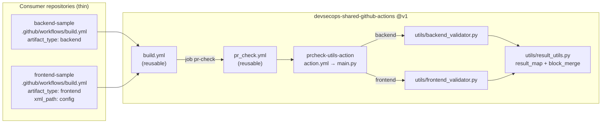

# Architecture

## Component view



Text view of the end-to-end flow:

```
Consumer workflow (on: pull_request)
   │  artifact_type, xml_path             ← explicit declaration, never inferred
   ▼
build.yml (workflow_call)
   ├─ job pr-check ── uses ./.github/workflows/pr_check.yml  (same commit as build.yml)
   │     │  artifact_type, xml_path
   │     ▼
   │  pr_check.yml (workflow_call) ─ job pr-checks
   │     [1] actions/checkout            ← consumer source at the PR merge ref
   │     [2] prcheck-utils-action@v1     ← artifact_type, xml_path
   │           main.py: VALIDATORS[artifact_type](repo_root, config)
   │             backend  → all **/pom.xml share one project artifactId?
   │             frontend → every *.xml under xml_path well-formed?
   │           result_map["artifact_consistency"] = { passed: true|false, ... }
   │           block_merge = any required result_map entry not passed
   │           outputs: result_map, block_merge
   │     [3] Enforce merge gate          ← exit 1 unless block_merge == "false"
   │
   └─ job build
         needs: pr-check
         if: needs.pr-check.result == 'success' && needs.pr-check.outputs.block_merge == 'false'
         checkout → type-specific build steps (mocked)
```

## Where the new logic plugs into build.yml

These are the build.yml steps the exercise asks to identify.

| Concern | Location | Explanation |
|---|---|---|
| **PR check runs relative to the build** | `build.yml` → `jobs.pr-check` | The first job. It calls `pr_check.yml` and hands over `artifact_type` and `xml_path` unchanged. No build step runs in this job. |
| **Source checkout before validation** | `pr_check.yml` → step `[1] Checkout source` | The first step of the PR-check job and a precondition of the action. Inside a reusable workflow, `actions/checkout` checks out the *caller's* repository (the consumer) at the PR merge commit, so validation sees exactly what would be merged. The `build` job checks out again because jobs don't share a filesystem. |
| **Artifact validation** | `pr_check.yml` → step `[2] Run PR checks` | Runs `prcheck-utils-action`, which adds `artifact_consistency` to `result_map` and recomputes `block_merge`. |
| **Where a failure blocks the build** | `pr_check.yml` → step `[3] Enforce merge gate`, plus `build.yml` → `jobs.build.needs` / `if` | The gate step turns `block_merge=true` into a failed job. `build` depends on `pr-check`, so it's skipped. The explicit `if:` also requires `block_merge == 'false'`, so nothing short of an explicit pass (not a missing output or an `always()` added later) lets the build run. |
| **Where a failure blocks the merge** | GitHub branch protection or rulesets (repository or organization settings) | The failed `PR checks` job is a failed status check on the PR. Listing it as a **required status check** is what disables the merge button. Workflow YAML can't do that by itself. |

## Input propagation

| Hop | Mechanism | Notes |
|---|---|---|
| consumer → build.yml | `jobs.build.with` | `artifact_type` is required; `xml_path` defaults to `""` |
| build.yml → pr_check.yml | `jobs.pr-check.with` | Forwarded unchanged: `${{ inputs.artifact_type }}` |
| pr_check.yml → action | step `with` | Forwarded unchanged |
| action → main.py | `env:` (`PRCHECK_*`) | Passed through env vars and never interpolated into the shell script, which closes off script injection from PR-controlled values |
| main.py → validator | `VALIDATORS[artifact_type]` | An unknown or empty type fails with the list of supported values |

`workflow_call` inputs can't declare an enum, so `artifact_type` is validated in one place: the action. An invalid value therefore fails the PR check with a clear message, and the build never runs.

## Decision factor: true/false → pass/fail → merge

1. The validator returns `CheckResult(passed=True|False, summary, errors, details)`. Configuration and parse problems are never swallowed: a missing path, no files, malformed XML or a missing `artifactId` all produce `passed=False` with an actionable message.
2. `main.py` writes this result to `result_map["artifact_consistency"]`, preserving any entries that earlier checks put there.
3. `block_merge = compute_block_merge(result_map)`, which is `true` if **any** required entry lacks `passed: true`. The artifact check doesn't decide merge on its own; it takes part in the same rule as every other check. Other failing checks still block even when artifact consistency passes, and the reverse holds too.
4. The action publishes `result_map` and `block_merge` and exits 0 (a crash exits 1 and still publishes `block_merge=true`). Keeping the verdict separate from enforcement guarantees the outputs are always published for the summary, downstream jobs and dashboards.
5. The gate step fails the job when `block_merge != "false"`. That gives:
   * **PR status: FAIL.** Branch protection blocks the merge.
   * **Build: skipped.** Enforced by `needs` plus `if`.

Reviewer-facing feedback: `main.py` writes a markdown table to the job summary and emits `::error file=…::` annotations, so malformed files show inline on the PR.

## Extending the framework

| Change | What to touch |
|---|---|
| New artifact type (for example `node`) | Add `utils/<type>_validator.py` and one entry in `VALIDATORS`. Consumers opt in with `artifact_type: <type>`. |
| New PR check (for example licence headers) | Add one entry in `CHECKS`. It becomes a new `result_map` key and automatically takes part in `block_merge`. |
| Advisory (non-blocking) check | Set `required=False` on its `CheckResult`. It's reported but never blocks. |
| New per-type setting | Add an optional input with a default to `build.yml`, `pr_check.yml` and `action.yml`. Existing consumers keep working unchanged. |
| Monorepo | The action already accepts `working_directory` (a scan root). Exposing it through the workflows is a one-line addition per hop. |

## Security notes

* Triggered by `pull_request` (not `pull_request_target`), so fork PRs run with a read-only token and no secrets. `permissions: contents: read` everywhere, and `persist-credentials: false` on checkout.
* Path inputs are resolved and rejected if they escape the repository root (absolute paths, `..`).
* The validators only parse XML. They never execute anything from the PR. The stdlib parser doesn't resolve external entities, and the expat versions bundled with current Python releases limit entity expansion. For stricter guarantees, `defusedxml` is a drop-in hardening step.
* In production, pin third-party actions (`actions/checkout`, `actions/setup-python`) to commit SHAs.
