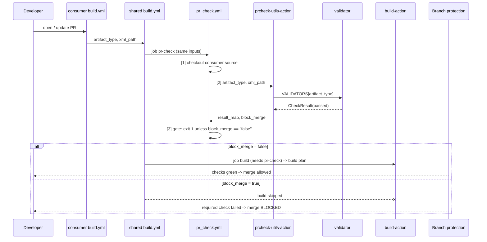

# End-to-end guide

This guide follows a single pull request through the whole system, one hop at a time. It shows what each file does, what data moves between them, and how to reproduce every result yourself. Read it top to bottom once and you'll understand the complete design.

---

## 1. The big picture in one minute

**The problem.** The organization has many repositories. Some are backend (Maven) and some are frontend (XML config). Every PR must pass an *artifact consistency* check before the code is built, and a failed check must block the merge.

**The solution.** All the logic lives in one shared repository. Every other repository contains a single, tiny workflow file that says what kind of artifact it is.

```
   +---------------------------+          +----------------------------+
   | backend-sample            |          | frontend-sample            |
   |   build.yml (14 lines)    |          |   build.yml (15 lines)     |
   |   artifact_type: backend  |          |   artifact_type: frontend  |
   |                           |          |   xml_path: config         |
   +-------------+-------------+          +--------------+-------------+
                 |                                       |
                 +--------- uses: .../build.yml@v1 ------+
                                     |
                                     v
   +--------------- devsecops-shared-github-actions (Shared Library) ---------------+
   |                                                                                |
   |   Workflow                              Actions                                |
   |     build.yml     orchestrates stages     build-action                         |
   |     pr_check.yml  checkout, check, gate   prcheck-utils-action                 |
   |                                           (each: action.yml, main.py, utils/)  |
   |                                                                                |
   +--------------------------------------------------------------------------------+
```

This is the layout drawn in `image.png`: *Repo (backend)* and *Repo (frontend)* consume a *Shared Library*, which holds *Workflow* (`build.yml`, `pr_check.yml`) and *Actions* (build action, PR_check action, each built from `Action.yml`, `Utils` and `main.py`).

| Repository | URL |
|---|---|
| Shared library | https://github.com/Mahesh2511/devsecops-shared-github-actions |
| Backend consumer | https://github.com/Mahesh2511/backend-sample |
| Frontend consumer | https://github.com/Mahesh2511/frontend-sample |

---

## 2. GitHub Actions concepts you need

| Concept | One-line meaning | Where it's used here |
|---|---|---|
| **Workflow** | A YAML file in `.github/workflows/` that runs on an event | Consumer `build.yml` runs `on: pull_request` |
| **Reusable workflow** | A workflow with `on: workflow_call` that other workflows call like a function, with typed `inputs` and `outputs` | Shared `build.yml` and `pr_check.yml` |
| **Job** | A set of steps on one fresh runner VM. Jobs don't share files | `pr-checks` and `build` |
| **`needs:`** | Makes a job wait for another job and **skip** if that job fails | `build` has `needs: pr-check` |
| **Composite action** | A reusable bundle of steps (`action.yml`), called from a step | `prcheck-utils-action`, `build-action` |
| **Step output** | A value a step writes to the `$GITHUB_OUTPUT` file | `result_map`, `block_merge` |
| **Status check** | Every job shows up on the PR as a passing or failing check | `build / PR Check / PR checks` |
| **Required status check** | A branch protection setting: the PR can't merge until the named check passes | Set on `main` in both sample repos |
| **Tag pinning (`@v1`)** | Selects which version of shared code is used | Consumers use `@v1` |

---

## 3. One PR, step by step

The example is the real [backend-sample PR #1](https://github.com/Mahesh2511/backend-sample/pull/1), which changes `service-b/pom.xml` from `<artifactId>sample-service</artifactId>` to `<artifactId>another-service</artifactId>`.

### Step 0: the developer opens a PR

GitHub fires the `pull_request` event in `backend-sample`.

### Step 1: the consumer workflow starts (`backend-sample/.github/workflows/build.yml`)

```yaml
on:
  pull_request:
jobs:
  build:
    uses: Mahesh2511/devsecops-shared-github-actions/.github/workflows/build.yml@v1
    with:
      artifact_type: backend
```

It doesn't validate or build anything. It only **declares** "I'm a backend repo" and hands control to the shared workflow at version `v1`.
*Data passed:* `artifact_type=backend`, `xml_path=""` (default).

### Step 2: shared `build.yml` runs the PR-check stage first

[`build.yml`](../.github/workflows/build.yml) has two jobs:

```yaml
pr-check:                                   # line 35
  uses: ./.github/workflows/pr_check.yml    # line 37: same repo, same commit as build.yml
  with:
    artifact_type: ${{ inputs.artifact_type }}
    xml_path: ${{ inputs.xml_path }}

build:                                      # line 49
  needs: pr-check                           # line 51: wait for, and depend on, the PR check
  if: ${{ needs.pr-check.result == 'success' && needs.pr-check.outputs.block_merge == 'false' }}
```

Because of `needs`, `build` can't start until `pr-check` finishes.
*Data passed:* the same two inputs, unchanged.

### Step 3: `pr_check.yml` checks out the code

[`pr_check.yml`](../.github/workflows/pr_check.yml) line 40: `actions/checkout`. Inside a reusable workflow this checks out the **calling** repository (backend-sample), at the PR's merge commit. Without this step there would be no files to validate.

### Step 4: `pr_check.yml` runs the PR-check action

Line 54: `uses: Mahesh2511/devsecops-shared-github-actions/actions/prcheck-utils-action@v1`, with the two inputs.

The action is referenced by full name and tag, not `./actions/...`, because after step 3 the `./` path refers to the *consumer's* files.

### Step 5: inside the action (`action.yml` -> `main.py`)

[`action.yml`](../actions/prcheck-utils-action/action.yml) sets up Python and runs `main.py`. It passes the inputs through environment variables (`PRCHECK_ARTIFACT_TYPE=backend`), never by pasting them into the shell script, which prevents injection.

[`main.py`](../actions/prcheck-utils-action/main.py):

1. `run_checks()` runs every check registered in `CHECKS`. Today there's one, `artifact_consistency`.
2. `run_artifact_consistency()` looks up `VALIDATORS["backend"]` and calls `validate_backend()`.
   * An unknown type such as `mobile` -> failure: *"Unsupported artifact_type 'mobile'. Supported values: backend, frontend."*

### Step 6: the backend validator (`utils/backend_validator.py`)

1. It finds every `pom.xml` recursively: `pom.xml`, `service-a/pom.xml`, `service-b/pom.xml`.
2. It parses each file and reads the `<artifactId>` that is a **direct child of `<project>`**. The one inside `<parent>` and any in `<dependencies>` are ignored.
3. It groups files by ID: `{"sample-service": ["pom.xml", "service-a/pom.xml"], "another-service": ["service-b/pom.xml"]}`.
4. There's more than one group, so the result is `passed=False`, with the error:
   `artifactId mismatch: 2 distinct values found: 'another-service' in service-b/pom.xml; 'sample-service' in pom.xml, service-a/pom.xml`

(For a frontend repo, `utils/frontend_validator.py` instead parses every `*.xml` under `xml_path` and reports any file that isn't well-formed, with line and column.)

### Step 7: result_map and block_merge (`utils/result_utils.py`)

The result is stored as one entry in the shared result map:

```json
{
  "artifact_consistency": {
    "passed": false, "required": true, "artifact_type": "backend",
    "summary": "Backend artifact consistency FAILED for 3 pom.xml file(s).",
    "errors": ["artifactId mismatch: 2 distinct values found: ..."],
    "details": { "files_inspected": [...], "artifact_ids": {...}, "files_by_artifact_id": {...} }
  }
}
```

Then `compute_block_merge()` runs. **If any required check lacks `passed: true`, `block_merge = true`.** It looks at the whole map, so a future `security_check` failure would block in exactly the same way.

`main.py` writes `result_map` and `block_merge=true` to `$GITHUB_OUTPUT`, writes a table to the job summary, prints an `::error::` annotation, and **exits 0**. Its job is to produce the verdict, not to enforce it.

### Step 8: the gate (`pr_check.yml` line 64, "Enforce merge gate")

```bash
if [ "$BLOCK_MERGE" = "false" ]; then exit 0; fi
echo "::error title=Merge blocked::..."; exit 1
```

`block_merge` is `true`, so the step exits 1, which fails the job `build / PR Check / PR checks`. Anything that isn't literally `false` (including a missing value) also fails. That makes the gate fail-safe.

### Step 9: the build is skipped

Back in `build.yml`, `pr-check` failed, so `needs` skips `build`. The `if:` condition would stop it too. The build action never runs.

### Step 10: the merge is blocked

`main` in backend-sample has a branch protection rule: **required status check `build / PR Check / PR checks`**, from GitHub Actions, enforced for admins. The check failed, so GitHub shows `mergeStateStatus: BLOCKED`, and `gh pr merge` was refused.

### Step 11 (pass path): the developer fixes the file

When every check passes, the result is `block_merge=false` -> the gate exits 0 -> the job passes -> the `build` job runs -> it checks out the code -> `build-action@v1` resolves the backend plan (`mvn -B -ntp verify`, publish) -> passes. The PR becomes mergeable. This is demonstrated on [frontend-sample PR #1](https://github.com/Mahesh2511/frontend-sample/pull/1): commit 1 broke the XML (failed, build skipped), commit 2 fixed it (passed, build ran).

---

## 4. Timeline diagram



---

## 5. How to reproduce everything yourself

### Locally (no GitHub needed)

```bash
cd implementation/shared-devsecops
python -m unittest discover -s tests -v          # 36 tests

# run the PR check exactly like the action does
python actions/prcheck-utils-action/main.py --artifact-type backend  --workspace ../backend-sample --enforce
python actions/prcheck-utils-action/main.py --artifact-type frontend --xml-path config --workspace ../frontend-sample --enforce
python actions/prcheck-utils-action/main.py --artifact-type backend  --workspace tests/fixtures/backend/mismatch --enforce   # exit 1

# run the build action
python actions/build-action/main.py --artifact-type frontend
```

### On GitHub

| To see... | Do this |
|---|---|
| A pass | Actions tab -> *Build* -> *Run workflow* on `main` (manual trigger), or open any harmless PR |
| A backend failure | Open [backend-sample PR #1](https://github.com/Mahesh2511/backend-sample/pull/1) -> Checks tab -> the failing step's log and the job summary |
| A frontend failure and its fix | [frontend-sample PR #1](https://github.com/Mahesh2511/frontend-sample/pull/1) -> the commits tab shows a failure, then a pass |
| The merge block | backend-sample PR #1 -> the merge box says required checks failed |
| The framework's own tests | [Framework CI runs](https://github.com/Mahesh2511/devsecops-shared-github-actions/actions): 36 unit tests, 11 PR-check scenarios, 2 build-action runs |

Create your own failure in two minutes:

```bash
gh repo clone Mahesh2511/frontend-sample && cd frontend-sample
git checkout -b try/broken-xml
sed -i 's#</locale>#<locale>#' config/settings.xml
git commit -am "try: break xml" && git push -u origin try/broken-xml
gh pr create --fill       # then watch: PR Check fails, Build is skipped, merge is blocked
```

---

## 6. How a change to the framework reaches consumers

1. Change the shared repo on a branch -> Framework CI (`ci.yml`) runs unit tests plus scenario tests of the real actions.
2. Merge to `main`, then tag the exact version and move the major tag:
   `git tag v1.1.0 && git tag -f v1 && git push origin v1.1.0 && git push -f origin v1`
3. Every consumer on `@v1` picks it up on its next run, with no consumer change needed. A breaking change goes out as `v2`, and consumers opt in by changing `@v1` -> `@v2`.

Release history here: `v1.0.0` (initial) -> `v1.0.1` (static build job name) -> `v1.1.0` (build-action). `v1` currently points to `v1.1.0`.

---

## 7. Where to go next

| Document | Purpose |
|---|---|
| [architecture.md](architecture.md) | Design reference: build.yml touchpoints, decision factor, extension points, security |
| [assumptions.md](assumptions.md) | Every mocked interface and interpretation decision |
| [test-scenarios.md](test-scenarios.md) | Full PASS/FAIL matrix and GitHub run evidence |
| [requirements-traceability.md](requirements-traceability.md) | Each requirement -> where and how it's fulfilled |
| [reviewer-guide.md](reviewer-guide.md) | A short guided review path for the evaluator |
